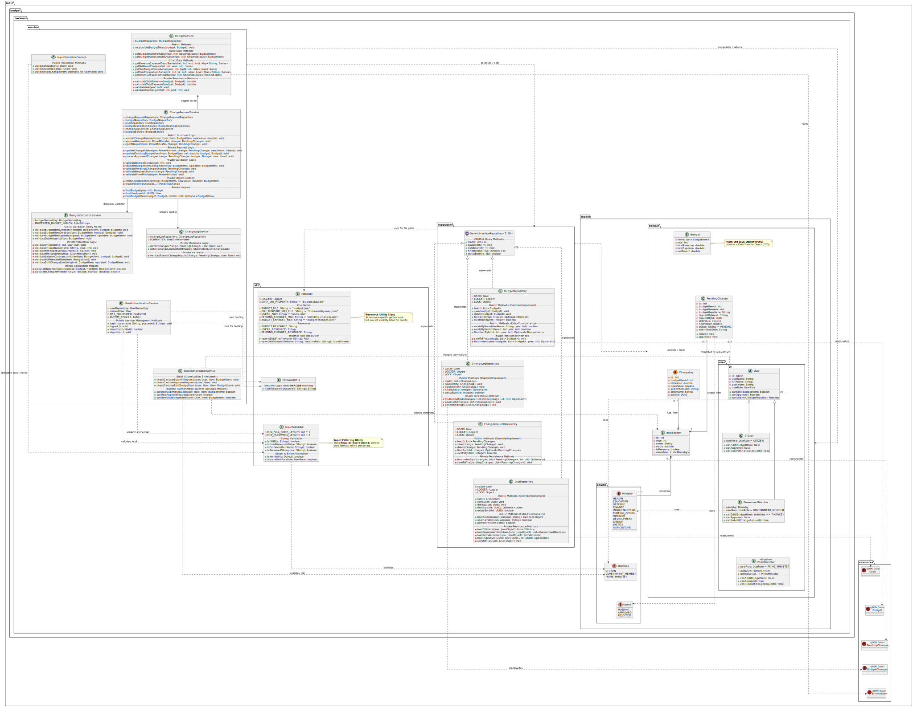
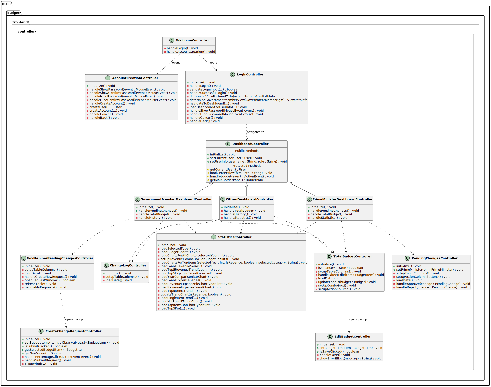

# SaveTheGovernment

## Table of Contents
- [Application Description](#application-description)
- [User Roles](#user-roles)
- [App Usage Instructions](#app-usage-instructions)
- [Repository Structure](#repository-structure)
- [System Architecture](#system-architecture-uml-diagram)
- [System Requirements](#system-requirements)
- [Software Patterns](#software-patterns)
- [Algorithms](#algorithms)
- [Installation](#installation)
- [Running the Application](#running-the-application)
- [API Documentation](#api--code-documentation-javadoc)
- [Repository Statistics](#repository-statistics)
- [Contribution](#contribution)
- [License](#license)

Government budget management system that allows different types of users to view, manage, and approve changes to the national budget.

## Application Description

**SaveTheGovernment** is a graphical application that manages the government budget.Includes data for budgets from year 2019 till 2026. The application supports multiple user types with different access rights and allows:

- Viewing the overall budget
- Viewing the change history
- Viewing statistics (distribution comparisons and time trend analysis, while estimating their future trajectory.)
- Managing budget items
- Submitting change requests
- Approving or rejecting change requests
- Recording all changes in a change log

## User Roles

The application supports four types of users with different access rights:

### 1. Citizen
- View the overall budget
- View the change history
- View statistics
- Update personal information (username, password, name)

### 2. Government Member
Includes all Citizen permissions, plus:
- Submit requests for budget fund modifications
- View the history of change requests

### 3. Finance Ministry Member
Includes all Government Member permissions, plus:
- Directly manage budget items

### 4. Prime Minister
- View the overall budget
- View the change history
- View statistics
- Approve or reject pending change requests

**Note**: Only one Prime Minister can exist in the system (Singleton pattern).

## App Usage Instructions

### 1. Logging into the application:
- Register with your credentials and select your role (Citizen, GovernmentMember, PrimeMinister).
- Log in to an existing account. For convenience, the following accounts are already available:
     - **Citizen:** username: lakis, password: Lakis123!
     - **GovMember (Finance Ministry):** username: kammenos, password: Kammenos123!
     - **PrimeMinister:** username: mitsotakis, password: Mitsotakis123!

### 2. App navigation:
- You can navigate the application using the **sidebar**.
- Remember that the application's features update dynamically depending on the user role.

### 3. View the State Budget:
- Select **View Total budget** from the sidebar
- Click on year and select a year to display the budget for that specific year. (default year: 2026)
- Click the button that appears at the top right to filter the budget table in various ways.

### 4. Editing a Budget Item:
- After logging in exclusively as **Finance Minister**.
- Select **View Total budget** from the sidebar.
- Click **edit** on the budget item of your choice.
- Enter the new amount and click **save** to confirm your change.

### 5. View Pending Changes:
- After logging in as a **Government Member**.
- Select **View Pending Changes** from the sidebar.
- Select **Create New Request** to request an amount change for a budget item in your ministry.
- Select **My Requests** to view only your own pending requests.
- Table filtering capability for pending changes is supported.

### 6. View Statistics:
- Select **View Statistics** from the sidebar.
- Select the year for which you want to view statistics. Years 2019 - 2026 are supported with 2026 as default.
- Select the **Budget Results** category to view charts related to the overall budget picture. This category includes 4 charts.
- Select the **Top Items** category to view charts related to the most significant budget items. This category includes 6 charts.
- Select the buttons that appear in the corners of the charts to **interact** with them.

### 7. View Change Log History:
- Select **View Change History** to view the budget change log history.
- Filtering is supported for Change Log table.

### 8. Managing Pending Changes:
- After logging in exclusively as Prime Minister.
- Select **Manage Pending Changes** 
- Click the **Approve** button to approve the specific change. Click **OK** to confirm your selection.
- Click the **Reject** button to reject the specific change. Click **OK** to confirm your selection.
- Filtering is supported for Pending Changes table.

## Repository Structure

### Main Directories

- **`src/main/java/budget/`** - Main application source code
  - **`backend/`** - Backend logic and business layer
    - `model/` - Data models and entities
    - `service/` - Business logic services
    - `repository/` - Data access layer
    - `exceptions/` - Custom exception classes
    - `util/` - Backend utility classes (validation, password hashing, paths, Regression Analysis)
  - **`frontend/`** - JavaFX GUI
     - `controller/` - JavaFX controllers managing user interface interactions and screen navigation
     - `util/` - Frontend helper classes (charts, alerts, tables, window management)
  - **`constants/`** - Application constants and messages

- **`src/test/java/budget/`** - Test suite
  - **`backend/`** - Backend unit tests
    - `model/` - Tests for domain models and enums
    - `service/` - Tests for business logic services
    - `repository/` - Tests for data access layer
    - `util/` - Tests for utility classes
  - **`frontend/`** - Frontend tests
    - `util/` - Tests for UI helper classes
  - **`constants/`** - Tests for application constants

- **`src/main/resources/`** - Application resources
  - `view/` - JavaFX layout files
  - `images/` - Image assets
  - `styles/` - CSS styles
  - `users.json` - User data storage
  - `bill-ministry-map.json` - Budget item to ministry mappings
  - `budget-changes.json` - Approved changes history
  - `budget.json` - State budget data (2019-2026)
  - `pending-changes.json` - Pending change requests

- **`diagram/`** - UML diagrams and documentation
  - `classDiagram.svg` - Class diagram visualization
  - `controllersDiagram.svg` - Controllers diagram

- **`pom.xml`** - Maven project configuration


## System Architecture (UML Diagram)

Below is the class diagram that describes the structure of the backend and the organization of the packages.



> 📂 **Diagram Source Code:** [File preview PlantUML](diagram/classDigramCode.puml)

### FrontEnd Controllers Architecture (UML Diagram)

The following is the class diagram for the budget.frontend.controller package.
* The inheritance hierarchy of the Dashboards (Citizen, GovernmentMember, PrimeMinister) derived from the base DashboardController.
* The **Navigation Flow** from the Login screen to the corresponding application screens.
* The **Dependencies**, representing which controllers are dynamically loaded within the main Dashboards


> 📂 **Diagram Source Code:** [View PlantUML file](diagram/controllersDigramCode.puml)

## System Requirements

- **Java**: Version 21 or latest
- **Maven**: Version 3.9.6 or latests
- **Operating System**: Windows, macOS, or Linux

## Software Patterns
- **Singleton pattern:** It is used for uniqueness Prime Minister
- **DI (Dependency Injection):** It is mainly used in the communication of the Services <-> Repositories
- **Repository Design Pattern:**  For clear separation of data and business logic
- **MVC Architecture (Model View Controller):** For efficient management of the GUI
- **Generic Programming:** Type-safe repository interface
  - `GenericInterfaceRepository<T, ID>` allows flexible entity handling
- **Type-Safe Enum Pattern:** Enums with additional properties
  - `UserRole`, `Ministry`, `Status` enums with display names and descriptions

## Algorithms

### Security
- **SHA-256:** Cryptographic hashing algorithm for secure password storage in users.json
  - Implemented in `PasswordUtils.java`
  - Provides one-way encryption for user authentication

### Data Analysis & Statistics
- **Linear Regression:** Custom implementation for trend forecasting and budget prediction
  - Implemented in `Regression.java`
  - Calculates slope and intercept using least squares method
  - Used for predicting future budget trends in statistics charts

### Input Validation
- **Regular Expressions (Regex):** Pattern matching for input validation
  - Username validation: Alphanumeric characters and underscores
  - Password strength: Minimum 8 characters, uppercase, lowercase, digits, special characters
  - Full name validation: Latin characters, proper capitalization
  - UUID format validation
  - Implemented in `InputValidator.java`

### Data Operations
- **Filtering & Sorting:** Dynamic table data manipulation
  - Used in budget tables, pending changes, and change history views
  - Supports multi-criteria filtering
  
- **Stream Processing:** Java 8 Streams for efficient data aggregation
  - Statistical calculations (sum, average, min, max)
  - Budget item grouping by ministry
  - Implemented across service layer

### Data Structures
- **JSON Parsing:** Data serialization/deserialization with Gson library
- **ArrayList/List<T>:** Sequential storage for entities (budgets, users, pending changes, logs)
- **HashMap/Map<K,V>:** Key-value pairs for bill-ministry mappings
- **ObservableList<T>:** JavaFX observable collections for auto-updating UI tables and charts
- **FilteredList<T>:** Dynamic table filtering with predicates
- **Optional<T>:** Null-safe wrappers for repository operations
- **Stream<T> API:** Functional data processing pipelines for filtering, mapping, and aggregation
- **XYChart.Series/Data:** Time-series structures for statistical charts and regression analysis
- **PieChart.Data:** Sectional data for budget distribution visualization
- **synchronized blocks:** Thread-safe access for concurrent file operations

## Installation

### 1.  Repository Clone

```bash
git clone https://github.com/detandreas/SaveTheGoverment.git
cd SaveTheGoverment
```
### 2. Requirements Check
Make sure that you have installed Java 21 and Maven:
```bash
java -version    # It should display the version 21
mvn -version     #  It should display the version 3.9.6 or latest
```
## Running the Application

### Compile the program.
```bash
mvn clean verify # Executes the full build lifecycle:
                 # - Runs all unit tests
                 # - Generates JaCoCo code coverage reports
                 # - Runs Checkstyle code quality checks
                 # - Generates project documentation
                 # - Compiles source files
./mvnw clean verify
```

### Run tests
```bash
mvn test
./mvnw test
```

### Method 1: With Maven (It is recommended)

```bash
mvn javafx:run # If you have Maven installed on your computer
```
### Method 2: With Maven Wrapper

```bash
./mvnw javafx:run    # Linux/macOS
mvnw.cmd javafx:run   # Windows
```
## API / Code Documentation (Javadoc)

The project uses standard Javadoc comments for documenting
its public API.

### Generate Javadoc
To generate the API documentation, run:

```bash
./mvnw javadoc:javadoc
```

### Read API Documentation
```bash
open target/site/apidocs/index.html 
```

## Repository statistics

### Code Metrics
- **Total Lines:** 20,696
- **Code Lines:** 14,874
- **Pure Java:** 11,025 lines
- **java classes** 92

### Test Coverage
- **Backend Coverage: 97%** 
- **Test Classes: 30**
- **tests run: 382**

### Github
- **Commits: ~800**
- **Contributors: 8**


## Contribution

This application was developed as an assignment for the course **PROGRAMMING II** in the Department of Management Science and Technology in **AUEB**.

## License

This project is licensed under the Apache License 2.0.

📄 See [LICENSE](./LICENSE) for full details or visit the [official Apache License page](https://www.apache.org/licenses/LICENSE-2.0).
